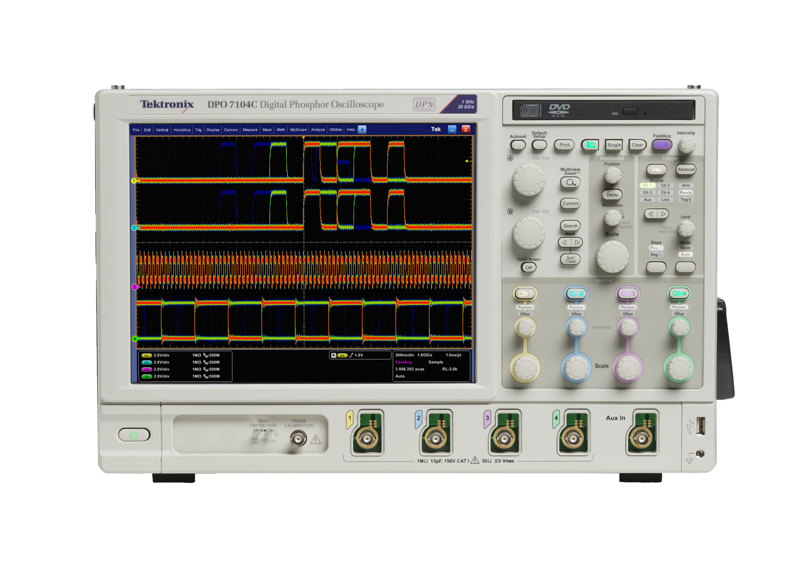

# membrane_timer
A timer project to verify the possibility of creating membrane-interface using 3D printing.

## Background

Since I was a child I've always been fascinated by control consoles - with all those buttons and sticks that one can manipulate, and all the indicator lights blinking - really gave me the feeling that I was some kind of engineer who were working on some really cool stuff. Now many years later I did became an engineer, and I am still attracted by those consoles.

Among those consoles, below is one of my favorate - usually seen on lab equipments such as spectrum analyzer, oscilloscope, etc.

*Look at the control panel on the right of the interface. This is an image of a Tektronix DPO7104C.*

Apart from the knobs and buttons that can be lit up, there are lamps behind the membrane cover that when turned on, a small area of the membrane (usually rectangular or circle) will be lit up, and this is like a popping dialog box with the prints on that area as its text.

## This project

I've always wanted to replicate the effect above, using some easy-to-implement tricks such as PCB and 3d printing. Recently I hurt my waist and was told to sit for no more than 30 minutes before get up and walk around. Then I started this project.

This project is a timer, or precisely, downcounter. The user can adjust the timer value by a knob, and start the timer using a big button on the top, much like an alarm clock.

The special part is this: This timer will be implementing the membrane interface just like in the DPO7104C.

To do this, the interface consists of 3 parts:

1. PCB: PCB holds all the LEDs, rotary encoders and buttons;
2. Membrane support: acts as the supporter for the membrane, with holes at the LEDs and buttons, guilding the lights to the right position and shielding other lights;
3. Membrane: The most outside layer.

## FYI

Some people may argue that nowadays you can do almost everything using a touch screen. Truely in that way the entire user interface can be completely software-defined, hence gain flexibility. However we are talking about hobbies here, and that means efforts for the "not-so-necessary".